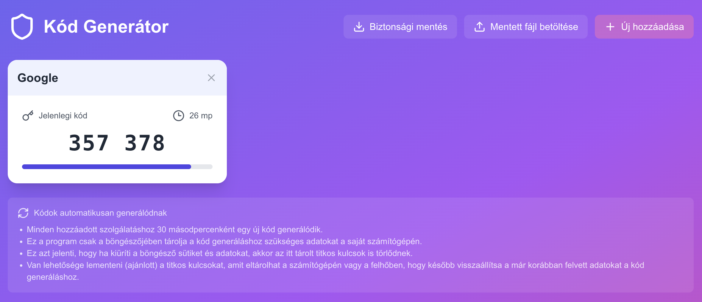

# Hungarian 2-factor code generator

This project is created so the official governmental authentication can list a code generator app that is developed by a Hungarian citizen for other Hungarian citizens.

[Live at https://kodgenerator.app](https://kodgenerator.app)

The underlying algorithm is provided by the open source [OTPAuth library](https://github.com/hectorm/otpauth).

The secrets are only stored in the local storage of the user's browser, no data is sent anywhere.

### Contributing

Contributions are welcomed.

This is a [Next.js](https://nextjs.org) project bootstrapped with [`create-next-app`](https://nextjs.org/docs/app/api-reference/cli/create-next-app).

